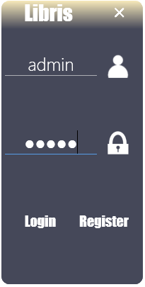
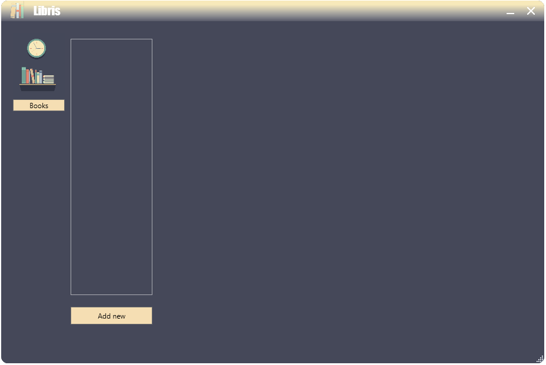

<h1 align="center"> Libris </h1>

    Desktop application for Windows allowing to record, save and track all books, board games and albums.

    
    

The idea behind the app designed and implemented in this project is to have a lightweight desktop app able to operate on both local (offline) and online resources regarding saved books and board games.
Choosing the C#.NET WPF framework was caused by ability to rapid development of desktop application and the stability of this tool. Also, having this app Windows-only made it almost obvious choice.

The purpose of this project is to guide one through and show how to:

* Create the WPF application from scratch with good practices,
* Add custom [separate login window](./DesktopApp/View/Screens/LoginWindow.xaml) to the app and [use it's result](./DesktopApp/View/Resources/Utilities/WindowDialogCloser.cs) returned after successful login,
* Create custom style of window with fully customized buttons and app's window header. All this implemented in [MainWindow XAML](./DesktopApp/View/MainWindow.xaml).

There are two windows of this application in general. The first window is always the login screen which is placed at the center of the user's desktop. This window allows to enter the credentials to login or register into the application.
The second window is the main window which contains all the application features. This screen can be moved, resized, or minimized.
Here are presented both windows:

| Login window | Main window |
| :-: | :-: |
|  |  |

---
  
## Installation & Usage ##

To play with this app:

* Clone the project or fork it and clone your fork,
* Open [Libris.sln](./Libris.sln) using the Visual Studio
 (Please remember to use at least Visual Studio 2019 to avoid compatibility issues)
* Hit the *Run* button to build and launch the app

or without the Visual Studio:

* Clone the project or your fork of this project,
* Open your terminal and `cd` to the directory of your clone,
* Run: `msbuild /p:Configuration=Release`
* Go to *./Build/DesktopApp/Release* directory in the project, where *Libris.exe* will be located,
* Launch the *Libris.exe* executable.

---

## Contributing ##

If you would like to contribute to the *Libris* project, you are more than welcome!

* Create an [Issue](https://github.com/BartoszKlonowski/libris/issues/new) and let the author handle it
* Create the [Pull Request](https://github.com/BartoszKlonowski/libris/compare) with the desired changes (please see further for how to develop this app).

---

## Development ##

If you plan to implement changes to this extension:

1. Clone your fork of this repository
2. Open [Libris.sln](./Libris.sln) using the Visual Studio 2019 (at least)
3. Implement your changes and create the PR

---

## Thank you! ##

If you like this project, or you find it helpful, please share your opinion with the author or just give it a star!
